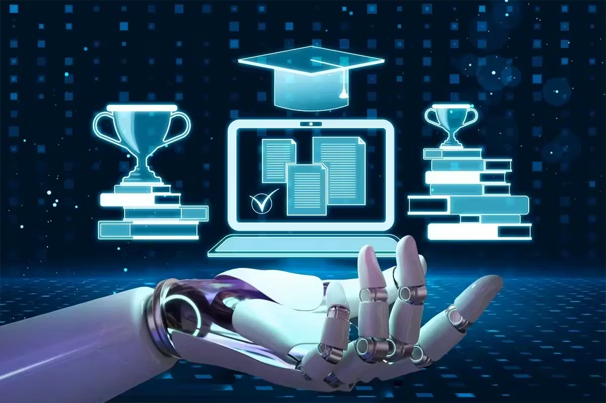

# 🧠 AI Based Automatic Examination Paper Evaluation System

> Intelligent Web Application for Automated Descriptive Answer Evaluation using AI & NLP

---

## 📌 Project Overview
AI Based Automatic Examination Paper Evaluation System is a web application that automatically evaluates descriptive exam answers using Artificial Intelligence, Machine Learning, and Natural Language Processing. The system compares student answers with model answers using semantic similarity techniques instead of simple keyword matching to generate fair and unbiased scores.

---

## 🎯 Objective
- Reduce manual paper correction effort  
- Eliminate human bias and inconsistency  
- Provide fast and accurate grading  
- Support scalable online examinations  

---

## ⚙️ Technologies Used
- Backend: Python, Django  
- Frontend: HTML, CSS, JavaScript  
- Database: MySQL  
- Server: WAMP Server  
- Libraries: NLTK, Gensim, Scikit-learn  

---

## 🧩 Core Features
- Admin panel to add subjects, questions, and model answers  
- Student login and exam submission  
- NLP preprocessing (tokenization, stop-word removal, lemmatization)  
- Semantic similarity using Word2Vec & Cosine Similarity  
- Automatic score and grade generation  
- Result storage and performance analysis  

---

## 📂 Project Structure
AI-Automatic-Exam-Evaluation/  
 ├── Source_Code/  
 ├── Documentation/  
 ├── README.md  
 └── .gitignore  

---

## 🚀 How to Run
1. Install Python and WAMP Server  
2. Install required libraries  
   pip install -r requirements.txt  
3. Start MySQL from WAMP  
4. Run Django server  
   python manage.py runserver  
5. Open http://127.0.0.1:8000/ in browser  

---

## 📊 Benefits
- Faster evaluation process  
- Consistent grading standards  
- Reduced faculty workload  
- Scalable for large examinations  

---

## 📚 Future Enhancements
- Deep Learning language models  
- Multilingual answer support  
- Handwritten answer recognition  
- Automatic feedback generation  

---

## 👩‍💻 Developed By
Seelam Harikadevi, 228B1A0519, 
Final Year B.Tech – Computer Science & Engineering  

---

⭐ This project demonstrates how AI can modernize and automate traditional examination systems.

